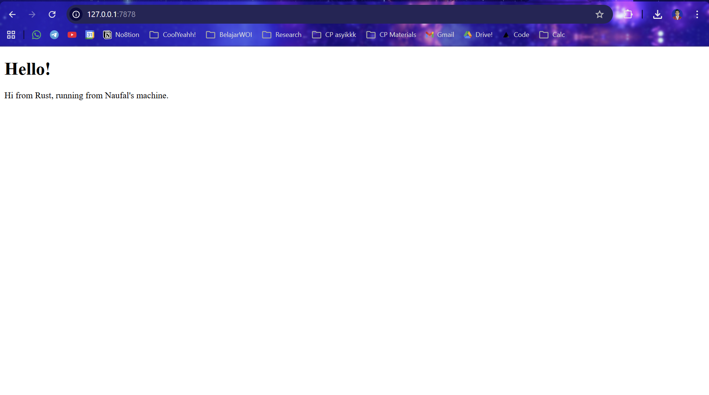
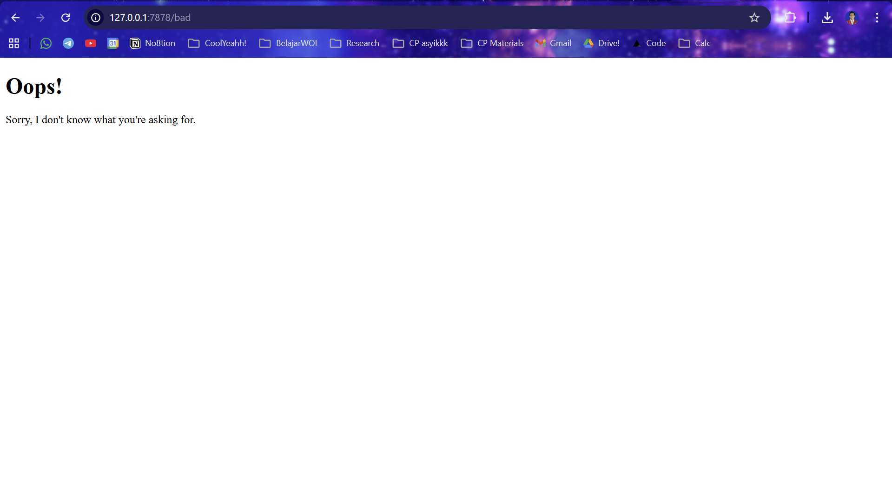

# Module 6 - Concurrency

## Commit 1 Reflection notes

Pada tahap ini saya mempelajari cara membuat web server sederhana menggunakan Rust standard library. Saya menggunakan `TcpListener` untuk membuat server mendengarkan koneksi TCP pada alamat `127.0.0.1:7878`. Ketika browser mengakses alamat tersebut, server menerima koneksi melalui iterator `listener.incoming()`. Setiap koneksi yang berhasil diterima direpresentasikan sebagai stream, meskipun pada tahap ini stream tersebut belum digunakan untuk membaca request atau mengirim response. Pesan `Connection established!` yang muncul di terminal menunjukkan bahwa server sudah berhasil menerima koneksi dari browser. Saya juga memahami bahwa browser dapat membuat lebih dari satu koneksi, sehingga pesan tersebut bisa muncul beberapa kali. Pada tahap ini server masih single-threaded, sehingga setiap request masih diproses satu per satu.

Pada tahap ini saya mempelajari bagaimana sebuah web server sederhana menerima koneksi dari browser menggunakan `TcpListener`. Setiap koneksi yang masuk direpresentasikan sebagai `TcpStream`, lalu stream tersebut dikirim ke fungsi `handle_connection` untuk diproses lebih lanjut. Saya juga mempelajari penggunaan `BufReader` untuk membaca isi request dari browser secara efisien. Dengan method `.lines()`, server dapat membaca HTTP request baris demi baris. Bagian `.take_while(|line| !line.is_empty())` digunakan untuk membaca header request sampai menemukan baris kosong, karena dalam format HTTP baris kosong menandakan akhir dari header. Dari output terminal, saya bisa melihat bahwa browser mengirim request seperti `GET / HTTP/1.1` beserta beberapa header seperti `Host`, `User-Agent`, dan `Accept`. Tahap ini membantu saya memahami bahwa komunikasi antara browser dan server dilakukan melalui teks HTTP request yang dikirim melalui koneksi TCP.

## Commit 2 Reflection notes

Pada tahap ini saya mempelajari cara membuat server mengirim response HTML ke browser. Sebelumnya server hanya membaca request dari browser dan mencetaknya ke terminal, tetapi belum memberikan response apa pun. Dengan menggunakan `fs::read_to_string("hello.html")`, server membaca isi file HTML sebagai string. Setelah itu server membuat HTTP response yang terdiri dari status line, header `Content-Length`, baris kosong, dan body HTML. Header `Content-Length` penting karena memberi tahu browser ukuran body response yang dikirim oleh server. Method `stream.write_all(response.as_bytes())` digunakan untuk mengirim response tersebut melalui koneksi TCP. Setelah tahap ini, browser akhirnya dapat merender halaman HTML yang dikirim oleh server Rust.

## Commit 3 Reflection notes

Pada tahap ini saya mempelajari cara membuat server memberikan response yang berbeda berdasarkan request path dari browser. Server membaca baris pertama HTTP request untuk mengetahui halaman apa yang sedang diminta oleh client. Jika request line bernilai `GET / HTTP/1.1`, server akan mengembalikan `hello.html` dengan status `200 OK`. Jika request line tidak sesuai dengan route yang dikenali, server akan mengembalikan `404.html` dengan status `404 NOT FOUND`. Saya juga memahami bahwa status line penting karena memberi informasi kepada browser apakah request berhasil atau gagal. Refactoring menggunakan `match` membuat kode lebih mudah dibaca dan lebih mudah dikembangkan ketika ingin menambahkan route baru. Dengan perubahan ini, server mulai memiliki perilaku yang lebih mirip web server sebenarnya karena dapat membedakan request valid dan request yang tidak ditemukan.

